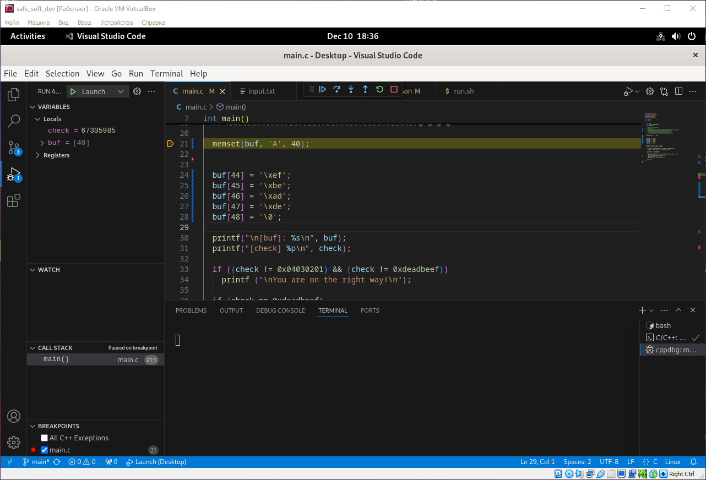
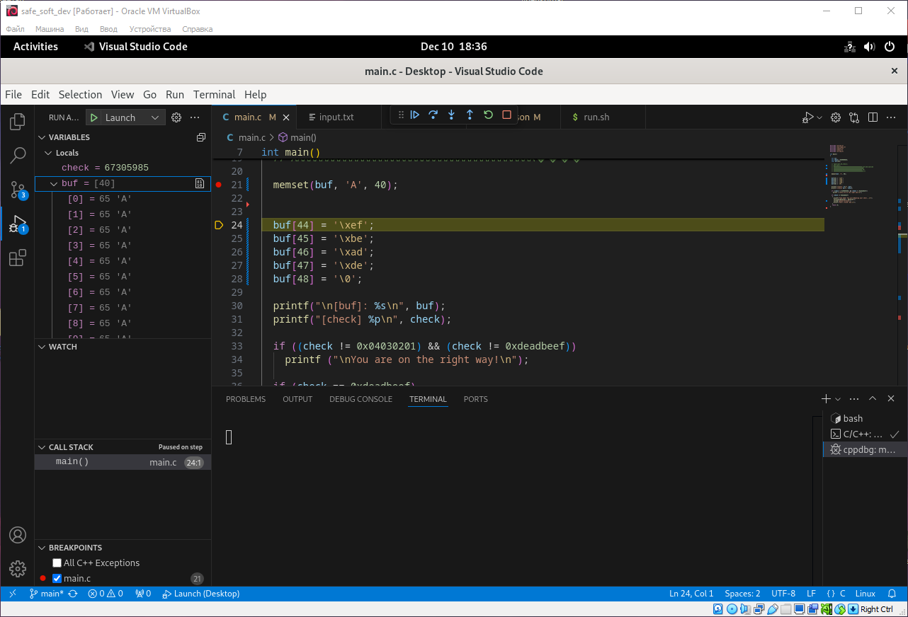
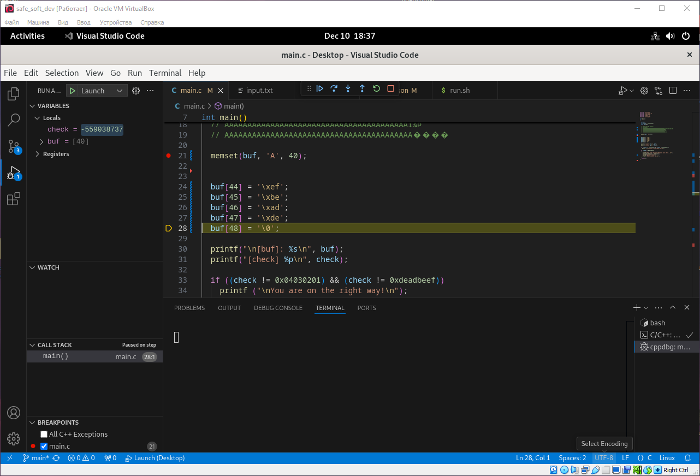
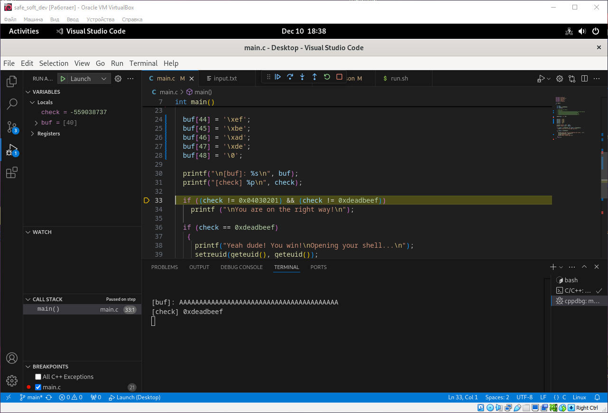
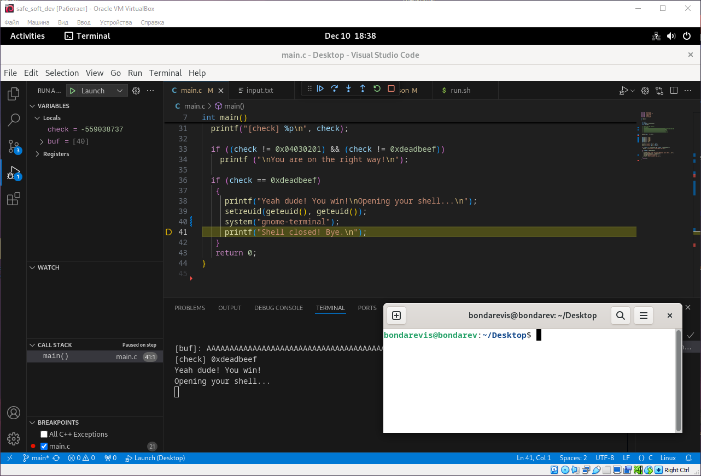

Для запуска потребуется `gcc` компилятор. В данной лабораторной работе используется `gcc version 12.2.0 (Debian 12.2.0-14)`
Для динамической отладки используется `GNU Debugger(gdb)`.

1. Динамическая отладка программного обеспечения с бинарной уязвимостью.
	Для начала немного видеизменим программу, для удобства, чтобы не нужно было вручную заполнять значение для переполнения буффера. Переполнение буффера происходит в 2 этапа:
	1. Заполнение буффера через `memset`
		```C
		memset(buf, 'A', 40);
		```
		

		
	2. Переполнение буффера специальными символами.
		Мы используем уязвимость переполнения буфера, заполняя буфер определённой последовательностью байтов. Цель заключается в том, чтобы изменить значение переменной `check` на 0xDEADBEEF. Для этого мы заполняем буфер фиктивными данными до тех пор, пока не достигнем области памяти, где хранится переменная `check`. После этого мы записываем в эту область нужное значение (0xDEADBEEF) путём непосредственного размещения байтов в порядке, соответствующем логике архитектуры (например, порядок little-endian для x86/x64).
		
		
		После переполнения буфера в переменной чек мы получаем значение `0xdeadbeef`

		
		
		Соответственно, у нас проходит проверка, после чего происходит открытие терминала.

		

        После чего программа завершается.
		
		### **Как работает переполнение буфера?**
		Буфер — это область памяти, куда временно записываются данные. Например, массив `char buf[40]` выделяет 40 байт под хранение текста.
		
		**Что происходит при переполнении?**  
		Если программа ожидает 40 байт, но мы передаёте, например, 70 байт, то **первые 40 байт записываются в буфер**, а **оставшиеся 30 байт начинают затирать память за буфером**.  
		В памяти могут быть:
		- **Переменные программы** (переменная чек, в нашем случае `check`).
		- **Адрес возврата из функции** (вызов функции `return address`).
		- **Управляющие данные стека**.
		
		**К чему это приводит?**
		- **Изменение переменных** (как в примере с `check = 0xDEADBEEF`).
		- **Подмена адреса возврата** — программа может вернуться не в то место, откуда была вызвана функция, а в код злоумышленника.
		- **Запуск произвольного кода** — возможность запустить свою команду, как, например, я запустил терминал.

2. Анализ кода и поиск уязвимостей.
	Код для анализа:
	```C
	#include <unistd.h>
	#include <sys/types.h>
	#include <stdlib.h>
	#include <stdio.h>
	
	int main()
	{
	
	  int var;
	  int check = 0x04030201;
	  char buf[40];
	
	  fgets(buf,45,stdin);
	
	  printf("\n[buf]: %s\n", buf);
	  printf("[check] %p\n", check);
	
	  if ((check != 0x04030201) && (check != 0xdeadbeef))
	    printf ("\nYou are on the right way!\n");
	
	  if (check == 0xdeadbeef)
	   {
	     printf("Yeah dude! You win!\nOpening your shell...\n");
	     setreuid(geteuid(), geteuid());
	     system("/bin/bash");
	     printf("Shell closed! Bye.\n");
	   }
	   return 0;
	}
	```
	
